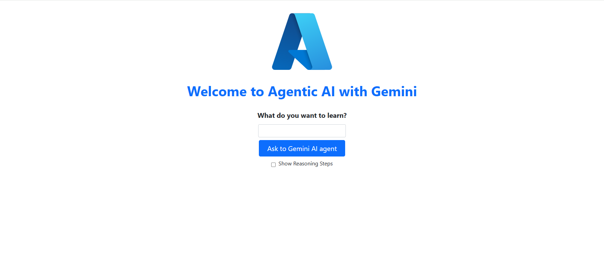
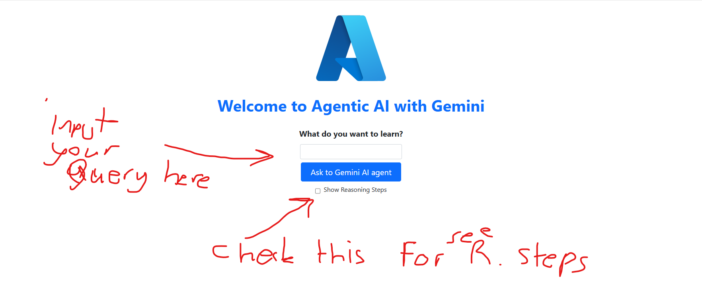

# Gemini-Agentic-AI
Agentic AI Chatbot with Multi-Step Reasoning and Dynamic Research

***In order the test solution please visit this address:***
***https://llm-api-app-llm-gemini-agentic-ai-dvfbgefrcug5aghq.canadacentral-01.azurewebsites.net/***

# High Overview of solution

## 1-)Brief summary about solution

* In my solution, as seen in the diagram, I used two LLM models from Google: Gemini Flash and Gemini Flash 8B. 
* When a user asks a question, the API request starts executing the nodes in this graph. First, it tries to find a similar or close question-answer pair in the vector database to the question asked by the user.
* The found result is evaluated by the main LLM to check if it is an appropriate source for the question. If the information is available or sufficient, the LLM generator model looks at the question and the answer and generates a new answer. If the found information is not available or not relevant, a web search is performed with the help of the Google Programmable Search Engine API.
* The results from this search are later evaluated by the hallucination controller. The LLM generator looks at the information from the web or vector database and generates a new answer. The generated hallucinations are checked by the hallucination controller based on three criteria. If the content is not valid for the user's question, the web search is called again. If the generated answer is not valid, a new answer is generated for the existing content and question. If the maximum number of attempts is reached, the cycle ends, and the current answer is returned. If the question, content, and generated answer are correct and valid, it means a successful result for the model, and the next step is taken.
* In the next step, the question and generated answer are recorded in the vector database for use in future conversations. The valid generated answer is sent to the API to return to the user.
## Example usage:
**Step1)** İ already asked to the chatbot and I am asking again  “Who is the Messi?”
So if you ask again and want to see reasoning steps result should be something like this(don’t forget to check include reasoning steps):
**Answer:**
'''
Lionel Andrés "Leo" Messi is an Argentine professional footballer. He captains both Inter Miami CF and the Argentina national team. He was born on June 24, 1987, in Rosario, Argentina.
Generated Reasoning steps
---ROUTE QUESTION---
---CHECK DOCUMENT RELEVANCE TO QUESTION---
---GRADE: DOCUMENT RELEVANT---
---ASSESS GRADED DOCUMENTS---
---DECISION: GENERATE---
---GENERATE---
---CHECK HALLUCINATIONS---
---DECISION: GENERATION IS GROUNDED IN DOCUMENTS---
---GRADE GENERATION vs QUESTION---
---DECISION: GENERATION ADDRESSES QUESTION---
---QUESTION AND ANSWER SAVED---
This steps means: doc is found and relevant no need to web search . Answer should be created then. After answer created it is checked by hallucination checker. Since generated answer is grounded in documents and answer is addresses question it is valid and safe to save and it sent to  API for user.
'''

**Step2)** İf I ask a question first time for example “Who is the C.Ronaldo? “  Let’s see what will happen.
***So if you ask first time a new question and want to see reasoning steps result should be something like this(don’t forget to check include reasoning steps).Since it is saved to db, also you should ask new player if you want to see the difference:***

**Answer:**
'''
C. Ronaldo, widely considered one of the greatest football players, is a forward known for his impressive goal-scoring ability. His best season with Manchester United was 2007-08. He is also highly active on social media, boasting millions of followers on Instagram.
Generated Reasoning steps
---ROUTE QUESTION---
---CHECK DOCUMENT RELEVANCE TO QUESTION---
---GRADE: DOCUMENT NOT RELEVANT---
---ASSESS GRADED DOCUMENTS---
---DECISION: NOT ALL DOCUMENTS ARE RELEVANT TO QUESTION, INCLUDE WEB SEARCH---
---WEB SEARCH---
---GENERATE---
---CHECK HALLUCINATIONS---
---DECISION: GENERATION IS GROUNDED IN DOCUMENTS---
---GRADE GENERATION vs QUESTION---
---DECISION: GENERATION ADDRESSES QUESTION---
---QUESTION AND ANSWER SAVED—

'''
 * As you see the differences from previous one. Since documents found not relevant or enough for the query, Now query directed to the web search for a new context information for LLMs.

 ## 2-) Web UI and API
 * For convenience, I created a web interface that facilitates communication with the API by modifying the repository https://github.com/Azure-Samples/msdocs-python-fastapi-webapp-quickstart.

 
* It is very easy to use please look to below for quick usage tuto.:
 
* You can try the My AI bot by writing your questions in the "What do you want to learn" section. To see the reasoning steps, check the "Show reasoning steps" checkbox. Then, click "Ask to Gemini AI agent."
* I created an API using Fast API and sent it to you. It returns a static HTML web page for simple API requests. Its functionalities are very limited, but I think it's sufficient for the task.
* Therefore, I won't write how to make API requests. Instead, you can test them from the interface.
* If you need further assistance or have any more questions, feel free to ask me!.(ayhantsyurt@gmail.com)
***ALSO YOU CAN CHECK THIS AZURE SORUCES TO GOOD UNDERSTANDING***
# Deploy a Python (FastAPI) web app to Azure App Service - Sample Application

This is the sample FastAPI application for the Azure Quickstart [Deploy a Python (Django, Flask or FastAPI) web app to Azure App Service](https://docs.microsoft.com/en-us/azure/app-service/quickstart-python). For instructions on how to create the Azure resources and deploy the application to Azure, refer to the Quickstart article.

Sample applications are available for the other frameworks here:
- Django [https://github.com/Azure-Samples/msdocs-python-django-webapp-quickstart](https://github.com/Azure-Samples/msdocs-python-django-webapp-quickstart)
- Flask [https://github.com/Azure-Samples/msdocs-python-flask-webapp-quickstart](https://github.com/Azure-Samples/msdocs-python-flask-webapp-quickstart)

If you need an Azure account, you can [create one for free](https://azure.microsoft.com/en-us/free/).

## Local Testing

To try the application on your local machine:

### Install the requirements

`pip install -r requirements.txt`

### Start the application

`uvicorn main:app --reload`

### Example call

http://127.0.0.1:8000/

## Next Steps

To learn more about FastAPI, see [FastAPI](https://fastapi.tiangolo.com/).

 ## 3-) Technologies Used

*	LangChain python api
*	LanGraph Python api
*	Huggingface transformers
*	Python and various ML libraries
*	Google ai studio (for free Gemini API key)
*	Google Gemini Models
*	Google Programmable Search Engine Api
*	Docker
*	Azure API service(for dockerized microservice deployment of api and web service )
*	Chroma local db for vectorstore inside docker deployment

## 4-) My Notes on Shortcomings and difficulties:
-	This is a large system, and within the 2-day timeframe, I had to skip some features. For example, although I log data like chat history locally during deployment, I only extract the question and answer packages, convert them into documents, and store them in the vector database for the LLM to use.
-	At first, I considered using Deepseek models, but their API services were unavailable due to being under attack. Therefore, I opted for the Google Gemini models, which I found to be both free and highly effective.
-	For such a large system, I used 2 LLM models, but with more time, it could be made larger and more functional. More agency work could be delegated to the LLMs. I believe this system is a great foundation and entry point for such enhancements.
-	For query refinement, a third language model and different algorithms can be used. Additionally, in the task document, I couldn't understand whether these questions should be asked to the user or used directly in the web search without asking the user. Therefore, I used the refined question in the web search
-	Although I haven't been able to test this system extensively, I believe it will yield successful results for most scenarios.
-	There might be some shortcomings or points I missed, and I plan to improve them as a personal project in the future when I have more time.
